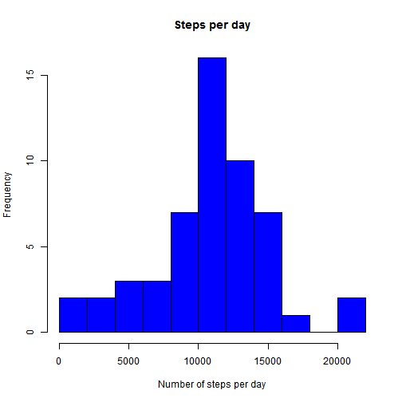
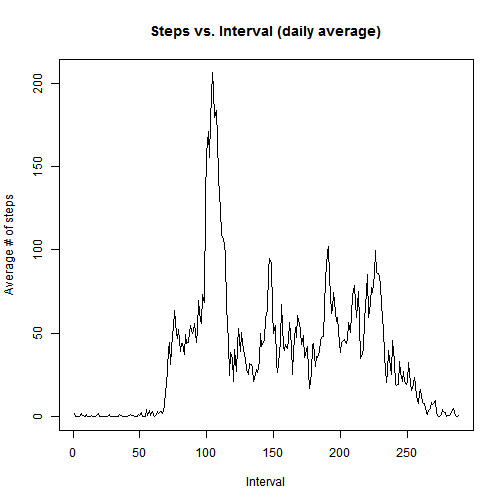
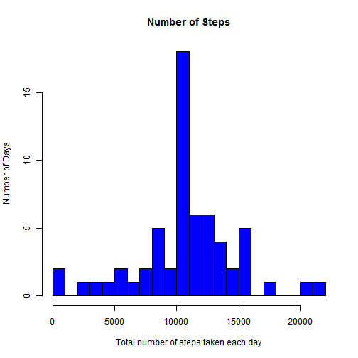

<!--
setwd("D:/DL/_DL_/_ELECTRONICA_/_ESTUDO_5/Reproducible Research/Peer Assessments/RepData_PeerAssessment1")
require(knitr)
knit2html("PA1_template.Rmd") #  -->


```r
rm(list=ls())  
# set global options
opts_chunk$set(echo=TRUE)

library(knitr)
library(lattice)
```

## Loading and preprocessing the data

```r
setwd("D:/DL/_DL_/_ELECTRONICA_/_ESTUDO_5/Reproducible Research/Peer Assessments/RepData_PeerAssessment1")
df <- read.csv("activity.csv", header = TRUE)
#str(df)
```
## What is mean total number of steps taken per day?
1. Make a histogram of the total number of steps taken each day
2. Calculate and report the **mean** and **median** total number of steps taken per day

```r
stepsTotalPerDay <- tapply(df$steps, df$date, sum)
hist(stepsTotalPerDay, breaks = 10, main = "Steps per day", 
    xlab = "Number of steps per day", ylab = "Frequency", col="Blue")
```

 

Mean total number of steps taken per day:

```r
mean(stepsTotalPerDay, na.rm = TRUE)
```

```
## [1] 10766.19
```
Median total number of steps taken per day:

```r
median(stepsTotalPerDay, na.rm = TRUE)
```

```
## [1] 10765
```


## What is the average daily activity pattern?
1. Make a time series plot (i.e. `type = "l"`) of the 5-minute interval (x-axis) and the average number of steps taken, averaged across all days (y-axis)
2. Which 5-minute interval, on average across all the days in the dataset, contains the maximum number of steps?

```r
stepsMeanPerInterval <- tapply(df$steps, df$interval, mean, na.rm = TRUE)
plot(stepsMeanPerInterval, type = "l", main = ("Steps vs. Interval (daily average)"), 
    ylab = "Average # of steps", xlab="Interval")
```

 


```r
 which.max(stepsMeanPerInterval)
```

```
## 835 
## 104
```

```r
names(which.max(stepsMeanPerInterval))      
```

```
## [1] "835"
```

```r
round(max(stepsMeanPerInterval))   
```

```
## [1] 206
```


## Imputing missing values
1. Calculate and report the total number of missing values in the dataset (i.e. the total number of rows with `NA`s)

Missing values:


```r
sum(is.na(df$steps))
```

```
## [1] 2304
```
There are 2304 missing values.


2. Devise a strategy for filling in all of the missing values in the dataset. The strategy does not need to be sophisticated. For example, you could use the mean/median for that day, or the mean for that 5-minute interval, etc.
3. Create a new dataset that is equal to the original dataset but with the missing data filled in.


```r
df_full <- df
nas <- is.na(df_full$steps)
avg_interval <- tapply(df_full$steps, df_full$interval, mean, na.rm=TRUE, simplify=TRUE)
df_full$steps[nas] <- avg_interval[as.character(df_full$interval[nas])]
```

Missing values:

```r
sum(is.na(df_full$steps))
```

```
## [1] 0
```


4. Make a histogram of the total number of steps taken each day and Calculate and report the **mean** and **median** total number of steps taken per day. Do these values differ from the estimates from the first part of the assignment? What is the impact of imputing missing data on the estimates of the total daily number of steps?


```r
stepsTotalPerDay_full <- tapply(df_full$steps, df_full$date, sum)

hist(stepsTotalPerDay_full, breaks = 20, main="Number of Steps", xlab="Total number of steps taken each day", ylab = "Number of Days", col="blue")
```

 

```r
mean(stepsTotalPerDay_full)
```

```
## [1] 10766.19
```

```r
mean(stepsTotalPerDay, na.rm = TRUE)
```

```
## [1] 10766.19
```

```r
median(stepsTotalPerDay_full)
```

```
## [1] 10766.19
```

```r
median(stepsTotalPerDay, na.rm = TRUE)
```

```
## [1] 10765
```

```r
abs(mean(stepsTotalPerDay, na.rm = TRUE) - mean(stepsTotalPerDay_full))
```

```
## [1] 0
```

```r
abs(median(stepsTotalPerDay, na.rm = TRUE) - median(stepsTotalPerDay_full))/median(stepsTotalPerDay, na.rm = TRUE)
```

```
## [1] 0.0001104207
```
The mean didn't change but, the median slightly changed about 0.01% of the original value.

The total steps per day differ:

```r
Diff <- sum(stepsTotalPerDay_full) - sum(stepsTotalPerDay, na.rm = TRUE)
Diff
```

```
## [1] 86129.51
```
This imply that the total steps per day increase.


## Are there differences in activity patterns between weekdays and weekends?
1. Create a new factor variable in the dataset with two levels -- "weekday" and "weekend" indicating whether a given date is a weekday or weekend day.


```r
df_full$weekdays <- weekdays(as.Date(df_full$date))
df_full$weekdays <- ifelse(df_full$weekdays %in% c("Saturday", "Sunday"),"weekend", "weekday")
#head(df_full)
```

1. Make a panel plot containing a time series plot (i.e. `type = "l"`) of the 5-minute interval (x-axis) and the average number of steps taken, averaged across all weekday days or weekend days (y-axis). 


```r
# aggregate steps as interval to get average number of steps in an interval across all days

stepsDay <- aggregate(steps ~ interval + weekdays, data=df_full, FUN="mean")

xyplot(steps~interval|weekdays, data=stepsDay,type="l",layout=c(1,2), ylab="Number of steps", xlab="Interval")
```

 

